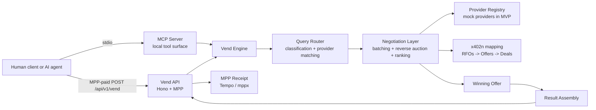
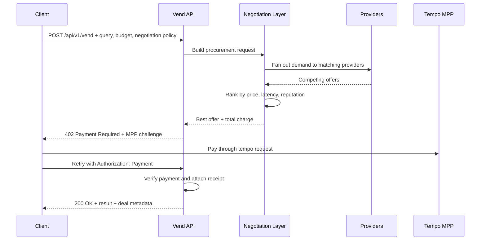

# The Vending Machine

The Vending Machine is a procurement engine for machine-payable services.

A client submits a query and a budget. The system classifies the request, routes it into a negotiation layer, collects competing offers, ranks them, auto-selects the best deal, charges the client through MPP on Tempo, and returns the result as a single API call.

This repository is the backend-only hackathon MVP:

- no UI
- no frontend
- one MPP-gated HTTP API
- one local MCP server over stdio
- one explicit negotiation layer for batching, auctioning, and winner selection

## CLI

This repo now has a package-shaped CLI so the vending machine is directly tryable from the terminal.

Build it:

```bash
npm run build
```

Run it in development:

```bash
npm run cli -- help
```

Quick tryout commands:

```bash
npm run demo:ascii
npm run providers:demo
npm run vend:demo
```

If you want the executable in your shell:

```bash
npm link
vending-machine help
```

README preview:

```text
      .--------------------------------.
      | THE VENDING MACHINE            |
      |--------------------------------|
      | query  : sanctions screen      |
      | budget : $1.00                 |
      | winner : ComplianceCheck Expr  |
      | total  : $0.48                 |
      |                                |
      | > #1 Compli  $0.42 180ms       |
      |   #2 Sancti  $0.57 240ms       |
      |________________________________|
             \\____________//
```

The CLI supports:

- `vending-machine demo`
- `vending-machine providers`
- `vending-machine vend --query ... --budget ...`

## Why this exists

An MPP directory is a list of services.

The Vending Machine is the buyer-side machine that turns a service request into a competitive procurement workflow:

1. turn the query into a structured demand object
2. broadcast the demand to candidate providers
3. collect and rank competing offers
4. accept the best deal automatically
5. charge the buyer once and return the output

That is the difference between a directory and a procurement engine.

## Architecture



## End-to-end flow



## Negotiation layer

The negotiation layer in this MVP is intentionally explicit because that is the product.

It is not just a scoring helper. It is the boundary where a raw query becomes a market event:

- the request becomes an RFO-shaped demand object
- candidate providers are gathered into a bidding set
- offers are ranked in reverse-auction style
- the top-ranked offer is accepted automatically when policy allows it

The design comes from Kairen's `x402n` negotiation network:

- local source: `/Users/sarthiborkar/Build/kairen-protocol/x402n`
- public site: https://x402n.kairen.xyz

The mapping is direct:

| Vending Machine stage | x402n concept | x402n route |
| --- | --- | --- |
| Create procurement request | RFO | `POST /api/v1/rfos` |
| Collect bids | Offers | `POST /api/v1/rfos/:rfo_id/offers` |
| Rank bids | Ranked offers | `GET /api/v1/rfos/:rfo_id/offers/ranked` |
| Accept winner | Deal creation | `POST /api/v1/offers/:offer_id/accept` |
| Track fulfillment and ledger | Deal lifecycle | `/api/v1/deals/...` |

The x402n repo also already defines the batch and auction fields that matter for this hackathon path:

- `batch_size`
- `allow_partial_fulfillment`
- `allow_counter_offers`
- `auto_accept_lowest`
- ranked offers by price, reputation, and delivery time

In this MVP, that behavior is implemented locally in [src/negotiation-layer.ts](/Users/sarthiborkar/Build/vending-machine/src/negotiation-layer.ts) so the procurement flow runs immediately.

The adapter boundary is deliberate:

- today: local negotiation execution against an in-memory provider registry
- next: replace the local auction runner with HTTP calls into `x402n`

## What is implemented

### Paid vend API

[src/http-server.ts](/Users/sarthiborkar/Build/vending-machine/src/http-server.ts) exposes:

- `POST /api/v1/vend`
- `GET /api/v1/vend/:id`
- `GET /api/v1/providers`
- `POST /api/v1/providers`
- `GET /health`

`POST /api/v1/vend` is MPP-gated with `mppx`. The route:

1. parses the request
2. prepares the negotiation request
3. calculates the winning offer and total price
4. returns an MPP challenge
5. verifies payment on retry
6. stores the vend record
7. returns the result with receipt headers

### Core procurement engine

[src/engine.ts](/Users/sarthiborkar/Build/vending-machine/src/engine.ts) and [src/router.ts](/Users/sarthiborkar/Build/vending-machine/src/router.ts) handle:

- category detection
- provider filtering by category, budget, and reputation
- preparation of the negotiation request
- winner finalization and deal record generation

### Negotiation and auctioning

[src/negotiation-layer.ts](/Users/sarthiborkar/Build/vending-machine/src/negotiation-layer.ts) turns each vend request into an RFO-like object with:

- `batchSize`
- `allowPartialFulfillment`
- `allowCounterOffers`
- `autoAcceptLowest`

Offers are ranked using a weighted score across:

- price
- latency
- provider reputation

The preference mode shifts the scoring weights:

- `cheap` pushes price harder
- `fast` pushes latency harder
- `balanced` keeps the score mixed

### MCP surface

[src/mcp-server.ts](/Users/sarthiborkar/Build/vending-machine/src/mcp-server.ts) exposes:

- `vend_query`
- `get_vend_status`
- `list_providers`

The MCP server uses the same vend engine and negotiation layer as the HTTP API. It is local stdio for developer and agent workflows. The paid MPP flow remains on the HTTP edge.

## Request model

`POST /api/v1/vend`

```json
{
  "query": "Screen Acme Corp for OFAC sanctions",
  "maxBudget": 1,
  "preferences": {
    "speed": "balanced",
    "minReputation": 0.8
  },
  "negotiation": {
    "batchSize": 1,
    "allowPartialFulfillment": false,
    "allowCounterOffers": true,
    "autoAcceptLowest": true
  }
}
```

Important request inputs:

- `query`: the procurement request
- `maxBudget`: hard budget ceiling used before payment challenge
- `preferences.speed`: scoring mode
- `preferences.minReputation`: provider quality floor
- `negotiation.batchSize`: number of units requested
- `negotiation.allowPartialFulfillment`: whether the batch may be split
- `negotiation.allowCounterOffers`: whether negotiation may go beyond first bids
- `negotiation.autoAcceptLowest`: whether the best current bid is accepted automatically

## Project structure

```text
src/
  engine.ts              vend orchestration and result finalization
  http-server.ts         Hono API + MPP payment gate
  mcp-server.ts          stdio MCP server
  negotiation-layer.ts   batching + auction + ranking layer
  providers.ts           mock provider registry
  router.ts              query classification
  store.ts               in-memory storage
  types.ts               shared contracts
```

## Run locally

Install dependencies:

```bash
npm install
```

Build:

```bash
npm run build
```

Typecheck:

```bash
npm run check
```

## Tempo setup

Tempo is used here as the MPP client path.

Install the CLI extensions:

```bash
"$HOME/.tempo/bin/tempo" add wallet
"$HOME/.tempo/bin/tempo" add request
```

Log in:

```bash
"$HOME/.tempo/bin/tempo" wallet login
"$HOME/.tempo/bin/tempo" wallet -t whoami
```

Use the wallet address returned by `tempo wallet -t whoami` as `TEMPO_RECIPIENT`.

The only required environment variable for the paid route is:

```bash
TEMPO_RECIPIENT=
```

Optional:

```bash
TEMPO_CURRENCY=0x20c0000000000000000000000000000000000000
PORT=3000
```

`TEMPO_CURRENCY` defaults to PathUSD on Tempo.

## Start the services

HTTP API:

```bash
npm run dev:http
```

MCP server:

```bash
npm run dev:mcp
```

## Call the paid vend API

Dry run:

```bash
"$HOME/.tempo/bin/tempo" request -t --dry-run -X POST \
  --json '{
    "query":"Screen Acme Corp for OFAC sanctions",
    "maxBudget":1,
    "preferences":{"speed":"balanced","minReputation":0.8},
    "negotiation":{"batchSize":1,"allowPartialFulfillment":false,"allowCounterOffers":true,"autoAcceptLowest":true}
  }' \
  http://127.0.0.1:3000/api/v1/vend
```

Paid execution:

```bash
"$HOME/.tempo/bin/tempo" request -t -X POST \
  --json '{
    "query":"Screen Acme Corp for OFAC sanctions",
    "maxBudget":1,
    "preferences":{"speed":"balanced","minReputation":0.8},
    "negotiation":{"batchSize":1,"allowPartialFulfillment":false,"allowCounterOffers":true,"autoAcceptLowest":true}
  }' \
  http://127.0.0.1:3000/api/v1/vend
```

Free registry endpoint:

```bash
curl -sS http://127.0.0.1:3000/api/v1/providers
```

The vend status endpoint uses the `id` returned by the create call.

## Verification completed

This repo has been verified with:

- `npm install`
- `npm run check`
- `npm run build`
- HTTP boot smoke test
- `GET /health`
- `GET /api/v1/providers`
- MCP `initialize` and `tools/list` handshake smoke test

## Current state

This is a serious backend MVP, not a mock landing page.

What is real:

- paid HTTP edge with MPP challenge flow
- explicit negotiation layer
- batch and auction policy in the request model
- auto-selection of the best offer
- local MCP tool surface

What is intentionally staged behind the adapter boundary:

- replacing local negotiation execution with live `x402n` API calls
- pushing provider-side fulfillment behind real paid downstream services

That is the correct cut for a hackathon MVP: the product shape is real, the interfaces are explicit, and the negotiation layer is already designed around the production protocol instead of being bolted on later.
