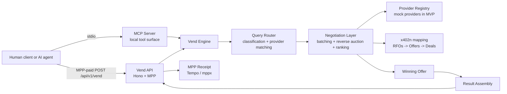
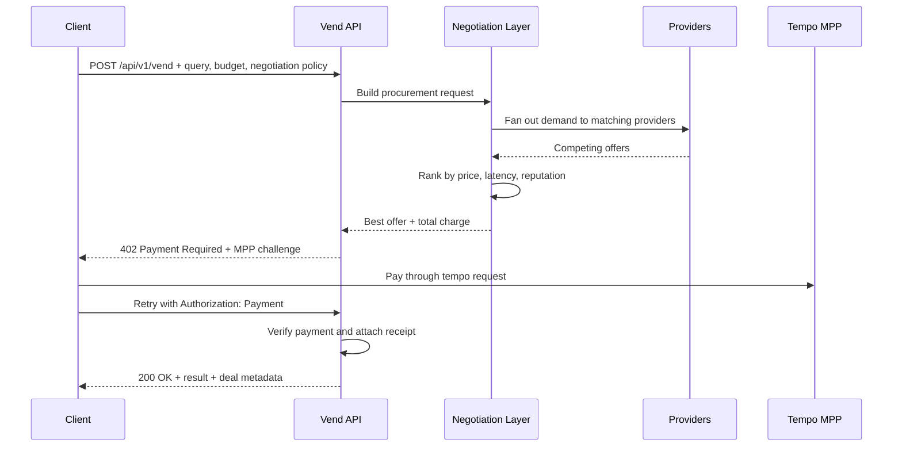

# Architecture

## Overview

The Vending Machine is a procurement engine for machine-payable services.

A client submits a query and a budget. The system classifies the request, routes it into a negotiation layer, collects competing offers, ranks them, auto-selects the best deal, charges the client through MPP on Tempo, and returns the result as a single API call.

This repository is the backend-only hackathon MVP:

- no UI
- one MPP-gated HTTP API
- one local MCP server over stdio
- one explicit negotiation layer for batching, auctioning, and winner selection

## Why This Exists

An MPP directory is a list of services.

The Vending Machine is the buyer-side machine that turns a service request into a competitive procurement workflow:

1. Turn the query into a structured demand object.
2. Broadcast the demand to candidate providers.
3. Collect and rank competing offers.
4. Accept the best deal automatically.
5. Charge the buyer once and return the output.

That is the difference between a directory and a procurement engine.

## System Architecture



## End-to-End Flow



## Negotiation Layer

The negotiation layer in this MVP is intentionally explicit because that is the product.

It is not just a scoring helper. It is the boundary where a raw query becomes a market event:

- the request becomes an RFO-shaped demand object
- candidate providers are gathered into a bidding set
- offers are ranked in reverse-auction style
- the top-ranked offer is accepted automatically when policy allows it

The design comes from Kairen's `x402n` negotiation network.

The mapping is direct:

| Vending Machine stage | x402n concept | x402n route |
| --- | --- | --- |
| Create procurement request | RFO | `POST /api/v1/rfos` |
| Collect bids | Offers | `POST /api/v1/rfos/:rfo_id/offers` |
| Rank bids | Ranked offers | `GET /api/v1/rfos/:rfo_id/offers/ranked` |
| Accept winner | Deal creation | `POST /api/v1/offers/:offer_id/accept` |
| Track fulfillment and ledger | Deal lifecycle | `/api/v1/deals/...` |

The current local implementation lives in [src/negotiation-layer.ts](/Users/sarthiborkar/Build/vending-machine/src/negotiation-layer.ts). The adapter boundary is deliberate:

- today: local negotiation execution against an in-memory provider registry
- next: replace the local auction runner with HTTP calls into `x402n`

## Onchain Layer

The negotiation loop stays offchain. The smart contract is a thin onchain receipt layer for auditable vend records on Tempo.

[contracts/VendingMachineLedger.sol](/Users/sarthiborkar/Build/vending-machine/contracts/VendingMachineLedger.sol) stores:

- requester address
- `queryHash`
- `resultHash`
- `totalPriceMicrousd`
- `category`
- `provider`
- timestamp

This keeps the architecture honest:

- routing and negotiation remain fast and flexible offchain
- Tempo gets an immutable receipt layer
- the CLI can prepare the exact payload for contract writes

## Implemented Surfaces

### Paid Vend API

[src/http-server.ts](/Users/sarthiborkar/Build/vending-machine/src/http-server.ts) exposes:

- `POST /api/v1/vend`
- `GET /api/v1/vend/:id`
- `GET /api/v1/providers`
- `POST /api/v1/providers`
- `GET /health`

`POST /api/v1/vend` is MPP-gated with `mppx`. The route:

1. Parses the request.
2. Prepares the negotiation request.
3. Calculates the winning offer and total price.
4. Returns an MPP challenge.
5. Verifies payment on retry.
6. Stores the vend record.
7. Returns the result with receipt headers.

### Core Procurement Engine

[src/engine.ts](/Users/sarthiborkar/Build/vending-machine/src/engine.ts) and [src/router.ts](/Users/sarthiborkar/Build/vending-machine/src/router.ts) handle:

- category detection
- provider filtering by category, budget, and reputation
- preparation of the negotiation request
- winner finalization and deal record generation

### Negotiation and Ranking

[src/negotiation-layer.ts](/Users/sarthiborkar/Build/vending-machine/src/negotiation-layer.ts) turns each vend request into an RFO-like object with:

- `batchSize`
- `allowPartialFulfillment`
- `allowCounterOffers`
- `autoAcceptLowest`

Offers are ranked using a weighted score across:

- price
- latency
- provider reputation

The preference mode shifts the scoring weights:

- `cheap` pushes price harder
- `fast` pushes latency harder
- `balanced` keeps the score mixed

### MCP Surface

[src/mcp-server.ts](/Users/sarthiborkar/Build/vending-machine/src/mcp-server.ts) exposes:

- `vend_query`
- `get_vend_status`
- `list_providers`

The MCP server uses the same vend engine and negotiation layer as the HTTP API. It is local stdio for developer and agent workflows. The paid MPP flow remains on the HTTP edge.

## Request Model

`POST /api/v1/vend`

```json
{
  "query": "Screen Acme Corp for OFAC sanctions",
  "maxBudget": 1,
  "preferences": {
    "speed": "balanced",
    "minReputation": 0.8
  },
  "negotiation": {
    "batchSize": 1,
    "allowPartialFulfillment": false,
    "allowCounterOffers": true,
    "autoAcceptLowest": true
  }
}
```

Important request inputs:

- `query`: the procurement request
- `maxBudget`: hard budget ceiling used before payment challenge
- `preferences.speed`: scoring mode
- `preferences.minReputation`: provider quality floor
- `negotiation.batchSize`: number of units requested
- `negotiation.allowPartialFulfillment`: whether the batch may be split
- `negotiation.allowCounterOffers`: whether negotiation may go beyond first bids
- `negotiation.autoAcceptLowest`: whether the best current bid is accepted automatically

## Project Structure

```text
src/
  ascii.ts               shared terminal rendering
  cli.ts                 package binary entrypoint
  engine.ts              vend orchestration and result finalization
  http-server.ts         Hono API + MPP payment gate
  index.ts               package exports
  mcp-server.ts          stdio MCP server
  negotiation-layer.ts   batching + auction + ranking layer
  providers.ts           mock provider registry
  router.ts              query classification
  store.ts               in-memory storage
  types.ts               shared contracts

contracts/
  VendingMachineLedger.sol

script/
  tempo/
    authorize_access_key.sh
    check_tempo_balances.sh
    create_access_key.sh
    deploy_tempo.sh
    fund_tempo.sh
    libtempo.sh
```

## Round-One Boundary

What is real in this cut:

- package-shaped CLI
- paid HTTP edge with MPP challenge flow
- explicit negotiation layer
- Tempo-oriented receipt contract
- batch and auction policy in the request model
- auto-selection of the best offer
- local MCP tool surface

What is intentionally staged behind the adapter boundary:

- replacing local negotiation execution with live `x402n` API calls
- pushing provider-side fulfillment behind real paid downstream services

That is the right cut for round one: the product shape is real, the interfaces are explicit, and the architecture leaves room for round-two integrations without bloating the submission root.
